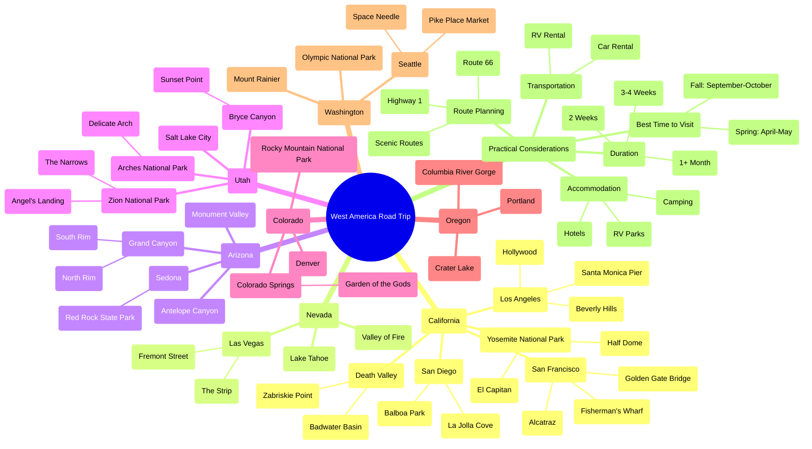

# West America Road Trip Mindmap

## Interactive Planning Resources

- **National Parks Reservations**: [Recreation.gov](https://www.recreation.gov/)
- **Road Conditions**: [US Road Conditions Map](https://www.fhwa.dot.gov/trafficinfo/index.htm)
- **Weather Information**: [National Weather Service](https://www.weather.gov/)
- **Distance Calculator**: [Google Maps](https://maps.google.com)

## Suggested Routes

### Classic Western Loop (2 weeks)
- San Francisco → Yosemite → Death Valley → Las Vegas → Grand Canyon → Zion → Bryce Canyon → Salt Lake City → Lake Tahoe → San Francisco

### Pacific Coast Highway (1-2 weeks)
- Seattle → Olympic National Park → Portland → Redwoods → San Francisco → Big Sur → Los Angeles → San Diego

### Southwest Desert Tour (2 weeks)
- Las Vegas → Zion → Bryce Canyon → Monument Valley → Antelope Canyon → Grand Canyon → Sedona → Death Valley → Las Vegas

## Packing Essentials

- Hiking boots
- Day pack
- Water bottles
- Sun protection
- First aid kit
- Navigation tools
- Camera
- Layers of clothing (temperatures vary widely)